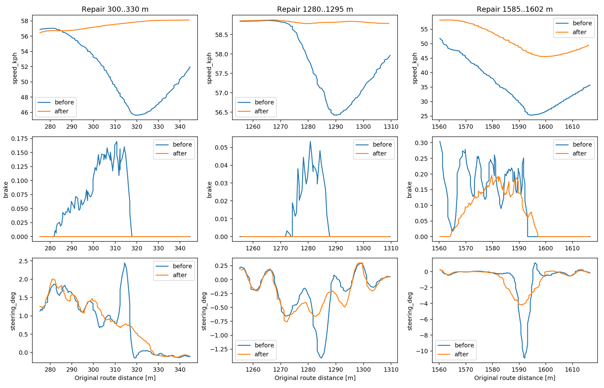

# 시뮬레이터 정량 검증 요약

이 문서는 자소서·포트폴리오에 인용할 수 있도록 전체 개발 전후 결과, 통제 A/B,
실패한 후보를 분리해 정리한다. 원본 rosbag, resolved YAML, 로그와 전체 시계열은
로컬 `artifacts/`에 보존한다. 전체 개발 전후 수치는 제어기·로컬라이제이션·경로가
함께 바뀐 결과이고, 아래 junction A/B만 같은 제어 설정에서 경로만 바꾼 비교다.

전체 정량값은 [portfolio_metrics.csv](portfolio_metrics.csv)에 `raw_change_pct`와
좋은 방향을 양수로 통일한 `improvement_pct`를 함께 기록했다. `status=adopted`는
현재 경로에 반영된 결과, `supporting_design`은 현재 설계 방향을 결정한 반복시험,
`rejected`는 안전성이나 안정성이 나빠져 폐기한 후보를 뜻한다.

## 개발 초기 미튜닝 MPC → 최종 채택 상태

초기 미튜닝 Autoware MPC의 독립 완주 3회와 최종 채택 상태 1회를 동일 분석 코드로
재계산했다. `초기 최악`은 동일한 한 주행이 아니라 각 지표별 초기 3회 중 가장 나쁜
값이다. 개선율은 초기 3회 평균 대비이며, 최악 대비 개선율도 CSV에 함께 남겼다.

| 지표 | 초기 3회 평균 | 초기 최악 | 최종 | 평균 대비 개선 | 최악 대비 개선 |
| --- | ---: | ---: | ---: | ---: | ---: |
| raw-GPS CTE RMS | 0.08534 m | 0.08632 m | 0.05872 m | **31.19%** | 31.97% |
| raw-GPS CTE p95 | 0.16871 m | 0.17098 m | 0.11417 m | **32.33%** | 33.23% |
| localized-pose CTE RMS | 0.08534 m | 0.08631 m | 0.03195 m | **62.56%** | 62.98% |
| localized-pose CTE p95 | 0.16870 m | 0.17093 m | 0.07307 m | **56.69%** | 57.25% |
| 고속 직선 CTE RMS | 0.05799 m | 0.05985 m | 0.01360 m | **76.55%** | 77.28% |
| 고속 직선 heading RMS | 0.3581° | 0.3828° | 0.1024° | **71.40%** | 73.24% |
| raw-GPS heading RMS | 1.0079° | 1.0190° | 0.6871° | **31.83%** | 32.57% |
| 고속 직선 yaw-rate RMS | 1.5401°/s | 1.6058°/s | 1.1240°/s | **27.02%** | 30.01% |
| 고속 직선 조향 변화율 RMS | 2.1173°/s | 2.1534°/s | 1.5591°/s | **26.37%** | 27.60% |
| 고속 직선 1초 조향 진폭 p95 | 0.9834° | 1.0532° | 0.6311° | **35.82%** | 40.08% |
| 고속 직선 CTE 2 cm 교차 횟수 | 130.3회 | 138회 | 6회 | **95.40%** | 95.65% |
| 가속-제동 명령 전환 빈도 | 28.52회/min | 29.22회/min | 19.58회/min | **31.35%** | 32.98% |
| 추정 jerk RMS | 3.7285 m/s³ | 3.8681 m/s³ | 1.6352 m/s³ | **56.14%** | 57.73% |
| 평균 속도 | 42.478 km/h | 42.356 km/h | 43.894 km/h | **3.33%** | 3.63% |
| 기록 완주 시간 | 186.069 s | 186.572 s | 178.658 s | **3.98%** | 4.24% |

raw-GPS CTE RMS `31.19%` 개선을 상태추정 필터 영향이 비교적 적은 대표 추종 수치로
사용한다. localized-pose CTE RMS `62.56%`에는 GPS 계단 변화 보완 등 로컬라이제이션
개선도 포함된다. 다만 raw GPS도 양자화되어 있고 경로 자체가 변경됐으므로 순수 MPC
게인 효과는 아니다. 최종 경로 길이는 초기 3회 평균보다 `0.78%` 짧아 기록 단축에는
경로 길이 차이도 일부 포함된다.

따라서 이 결과는 “초기 스택에서 최종 스택까지의 end-to-end 개선”으로 인용하고,
개별 변경의 효과는 아래 동일 경로 3회 대 3회 또는 동일 설정 경로 A/B로 구분한다.
실행별 원자료는 [development_runs.csv](development_runs.csv), 계산된 18개 지표는
[development_progress.csv](development_progress.csv)에 있다.

## 한눈에 보는 결과

현재 기본 설정과 채택 경로의 1회 완주 결과는 다음과 같다.

| 지표 | 결과 |
| --- | ---: |
| 기록 완주 시간 / 거리 | 178.658 s / 2178.328 m |
| 전체 CTE RMS | 0.03278 m |
| 최대 절대 CTE | 0.16648 m |
| 최대 속도 | 58.905 km/h |
| lateral inactive / longitudinal fallback sample | 0 / 1 |
| 종료 Manual/P/정지 검증 | 통과 |

동일 제어기·로컬라이제이션에서 경로만 변경한 전후 비교의 핵심 개선은 다음과 같다.

- 문제 교차로 최저속도 `24.41%`, `4.18%`, `80.03%` 증가
- 최대 heading 오차 `68.84%`, `59.56%`, `85.95%` 감소
- 최대 brake 명령 `100%`, `100%`, `29.70%` 감소
- 두 지점의 국소 CTE RMS `54.83%`, `52.61%` 감소
- 기록 완주 시간 `1.84%` 감소, 최대 절대 CTE `0.74%` 감소

반대로 전체 CTE RMS는 `0.65%` 증가했고 한 지점의 국소 CTE RMS는 `156.03%`
증가했다. 따라서 “모든 구간의 추종 오차가 개선됐다”고 주장하지 않는다.

CTE 개선율은 전 구간과 문제 구간을 분리해 해석한다.

| CTE 지표 | 보정 전 | 보정 후 | 개선율 |
| --- | ---: | ---: | ---: |
| 전체 RMS | 0.03256 m | 0.03278 m | **-0.65%** |
| 최대 절대값 | 0.16773 m | 0.16648 m | **+0.74%** |
| 315.8 m 국소 RMS | 0.01587 m | 0.00717 m | **+54.83%** |
| 1285.7 m 국소 RMS | 0.00993 m | 0.02542 m | **-156.03%** |
| 1593.2 m 국소 RMS | 0.03987 m | 0.01890 m | **+52.61%** |

여기서 개선율 양수는 오차 감소, 음수는 악화를 뜻한다. 전 구간 CTE가 개선됐다고
쓰지 않고, 분기·합류 문제 지점 두 곳에서 국소 CTE가 약 53~55% 감소했다고 쓴다.

## 조향·종방향 안정성 반복시험

기준 yaw 계산 범위를 곡률 계산 범위와 맞춘 실험은 동일 경로에서 조건별 3회씩
수행했다. 이 실험은 이후 설정을 선택한 근거지만 현재 `yaw_smoothing_num=14` 자체의
독립 A/B는 아니다.

| 지표 | 변경 전 | 변경 후 | 개선율 |
| --- | ---: | ---: | ---: |
| 급곡선 조향 명령 변화율 RMS | 22.7029°/s | 18.2197°/s | **19.75%** |
| 중곡률 조향 명령 변화율 RMS | 27.6292°/s | 17.9806°/s | **34.92%** |
| 첫 좌회전 조향 명령 변화율 RMS | 23.4405°/s | 15.7521°/s | **32.80%** |
| 첫 우회전 조향 명령 변화율 RMS | 15.7192°/s | 15.1302°/s | **3.75%** |
| 추정 jerk RMS | 2.7013 m/s³ | 2.1407 m/s³ | **20.75%** |
| 강한 brake 명령 에피소드 | 2회/3주행 | 1회/3주행 | 50% 감소 |

직선 조향 변화율은 `4.86%`, 급곡선 raw-GPS CTE는 `19.30%` 악화됐다. 명령
변화율에는 필요한 곡률 추종도 포함되고 jerk 비교는 두 조건의 도달거리가 달라,
각각 실제 바퀴 진동과 공식 승차감 지표로 해석하지 않는다.

## 차체·앞바퀴 여유 감사

동일 경로 3회 대 3회 yaw-window A/B에서 첫 우회전의 앞축 바깥 근사점 최소 여유
평균은 `0.247 -> 0.273 m`로 **10.48% 증가**했고, 세 주행 중 가장 작은 값도
`0.230 -> 0.263 m`로 **14.31% 증가**했다. 차체 사각형 최소 여유 평균은
`0.0188 -> 0.0517 m`로 약 `0.0329 m` 증가했다. 비율은 174.69%지만 기준값이
0에 가까워 과장되므로 절대 증가량 3.29 cm를 우선 사용한다. 최악 실행값은
`-0.0018 -> 0.0313 m`로 3.31 cm 증가했지만, 이 역시 안전 보장은 아니다.

변경 후 첫 우회전 반복 3회의 앞축 바깥 근사점 최소 여유는 `0.263~0.288 m`,
앞·뒤 오버행을 포함한 차체 사각형 최소 여유는 `0.031~0.080 m`였다. 경로 보정
A/B의 세 검사 지점 차체-도색 최소 여유는 다음과 같다.

| 진행거리 | 보정 전 | 보정 후 | 변화 |
| ---: | ---: | ---: | ---: |
| 약 300 m | 0.377 m | 0.398 m | 5.46% 증가 |
| 약 1280 m | 0.553 m | 0.573 m | 3.72% 증가 |
| 약 1585 m | 0.528 m | 0.344 m | **34.78% 감소** |

앞축 오차 비용 후보는 앞축 근사 여유 평균을 `0.273 -> 0.255 m`로 **6.67%**,
차체 여유 평균을 `0.052 -> 0.011 m`로 **79.49%** 악화시켰고 한 실행에서
`-0.013 m` 겹침 후보가 발생해 폐기했다. 이 값들은 실제 조향 타이어 폴리곤이나 simulator ground truth가
아니며, 10 Hz 추정 pose·차량 제원·MGeo 선폭으로 계산한 근접 지표다. 따라서
“최소 3.1 cm의 안전 여유를 보장했다”처럼 사용하면 안 된다.

## 채택 결과: 교차로 분기·합류 경로 보정

조건은 MORAI K-City, 속도 상한 `60 km/h`, `Manual -> I -> P` 동일 초기화,
Autoware MPC/로컬라이제이션 설정 동일, 각 후보 1회 완주다. RDDF가 선택한 MGeo
링크는 유지하고, 직진 경로에 분기·합류 차로의 짧은 굴곡이 섞인 세 지점의 경로
기하만 보정했다.

| 지표 | 보정 전 | 보정 후 | 변화 |
| --- | ---: | ---: | ---: |
| 기록 완주 시간 | 182.014 s | 178.658 s | **1.84% 감소** |
| 전체 CTE RMS | 0.03256 m | 0.03278 m | 0.65% 증가 |
| 최대 절대 CTE | 0.16773 m | 0.16648 m | 0.74% 감소 |
| 최대 속도 | 58.937 km/h | 58.905 km/h | 사실상 동일 |
| lateral inactive sample | 0 | 0 | 동일 |
| longitudinal fallback sample | 0 | 1 | 1회 증가 |

핵심 개선 지점:

| 진행거리 | 최저속도 | 최대 brake | 최대 heading 오차 | 국소 CTE RMS |
| ---: | ---: | ---: | ---: | ---: |
| 315.8 m | 45.64 → 56.77 km/h (**24.41% 증가**) | 0.170 → 0 (**100% 감소**) | 1.545° → 0.481° (**68.84% 감소**) | 0.0159 → 0.0072 m (**54.83% 감소**) |
| 1285.7 m | 56.42 → 58.78 km/h (**4.18% 증가**) | 0.053 → 0 (**100% 감소**) | 0.923° → 0.373° (**59.56% 감소**) | 0.0099 → 0.0254 m (156.03% 증가) |
| 1593.2 m | 25.31 → 45.56 km/h (**80.03% 증가**) | 0.279 → 0.196 (**29.70% 감소**) | 6.251° → 0.878° (**85.95% 감소**) | 0.0399 → 0.0189 m (**52.61% 감소**) |

좋은 수치만 고르지 않았다. 1285.7 m 지점의 국소 CTE가 커졌고, 1593 m 부근의
추정 차체-도색 최소 여유는 `0.528 m -> 0.344 m`로 줄었다. 후자는 10 Hz localized
pose와 알려진 도색선을 사용한 근사치이며 swept-volume이나 시뮬레이터 ground
truth가 아니다.

## 제어기 튜닝에서 폐기한 후보

Autoware MPC 초기 기준 3회 평균과 마지막 후보 1회를 동일 route XY로 비교했다.
후보는 raw-GPS CTE RMS를 `0.08534 -> 0.06304 m`로 26.13% 줄였지만, 고속 직선
조향 변화율 RMS가 34.08%, 급커브 yaw 오차가 17.73%, 추정 jerk가 21.00%
증가했다. 따라서 완주와 CTE 하나만 보고 채택하지 않고 폐기했다.

## 기존 자체 제어기를 남긴 이유

2026-09-03 자체 제어기 기준은 raw RDDF 한 바퀴에서 CTE RMS `0.07428 m`, 최대
절대 CTE `0.34875 m`, lateral solver 성공률 `100%`, solver p95 `4.08 ms`를
기록했다. 이 실행과 최종 Autoware 결과는 경로와 로컬라이제이션 조건이 달라 직접
개선율을 계산할 수 없다. 따라서 코드는 `morai_path_tracking/src/controllers/lateral`
에 `legacy` 비교 기준으로 보존하고 운영 기본값과는 분리했다.

## 소프트웨어 회귀 검증

2026-09-11 단일 워크스페이스에서 9개 ROS 패키지 Release install 빌드를 완료했고,
`morai_path_tracking`과 vendored `mpc_follower`를 포함한 결과는 `436 tests, 0
errors, 0 failures`였다. 별도 합성 ROS 계약시험에서 pose·속도·yaw·이전 조향·경로의
동일 timestamp 세대만 허용하고 stale, stamp mismatch, frame mismatch를 거부한 뒤
정상 입력에서 복구하는 것도 확인했다. 이는 소프트웨어 회귀 결과이며 주행 성능 수치로
해석하지 않는다.

## 인용 가능한 문장 예시

> MORAI K-City 폐루프 주행에서 RDDF-MGeo 분기·합류 경로의 국소 곡률 이상을
> 진단하고 동일 제어기 A/B를 수행해, 문제 교차로 최저속도를 최대 80.0% 높이고
> 최대 heading 오차를 최대 86.0%, 최대 제동 명령을 최대 100% 줄였다. 전체 CTE
> RMS 변화(+0.65%)와 차체 여유 감소도 함께 공개해 단일 지표 과적합을 피했다.

> 동일 경로에서 기준 yaw 계산 범위 변경을 3회 대 3회 폐루프 A/B로 검증해,
> 급곡선·중곡률 조향 명령 변화율 RMS를 각각 19.7%, 34.9% 줄이고 추정 jerk
> RMS를 20.8% 낮췄다. 동시에 직선 조향 변화율 4.9% 및 급곡선 raw-GPS CTE
> 19.3% 악화도 기록해 채택 범위와 잔여 문제를 구분했다.

‘주행 안전성을 확보했다’는 표현 대신 ‘시험 구간에서 조향 명령 변동성과 급제동
빈도를 낮췄고, 차체 근접 여유를 별도 감사했다’고 표현한다. 현재 자료는 충돌시험,
연속 swept-volume, 불확실성 상한을 포함하지 않아 안전 보장을 주장할 근거가 아니다.

## 한계

- 경로 보정 전·후 각각 `n=1`이므로 통계적 유의성 주장이 아니다.
- 기록 완주 시간은 로컬 lap-complete 조건까지의 시간이며 공식 대회 기록이 아니다.
- `brake`는 `0..1` 제어 명령이고 실제 제동거리나 감속도 감소율이 아니다.
- 100 km/h 고주로 주행은 검증하지 않았다.
- 센서 노이즈가 인가되지 않는 대회 조건의 시뮬레이터 결과이며 실차 성능 보장이 아니다.

수치 원본 경로와 route hash는 [source_manifest.csv](source_manifest.csv), 표 데이터는
[full_lap_summary.csv](full_lap_summary.csv), [junction_path_ab.csv](junction_path_ab.csv),
[controller_tuning_ab.csv](controller_tuning_ab.csv), 전체 포트폴리오 지표는
[portfolio_metrics.csv](portfolio_metrics.csv), 전체 개발 전후 값은
[development_progress.csv](development_progress.csv)에 있다. 빌드·시험 결과는
[verification_20260911.txt](verification_20260911.txt)에 별도로 고정했다.
